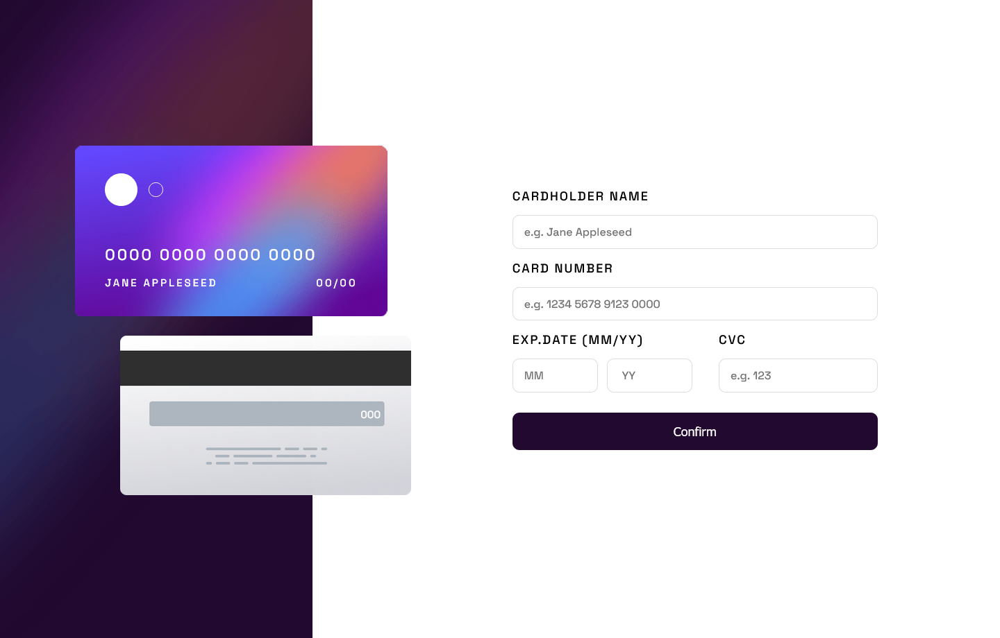
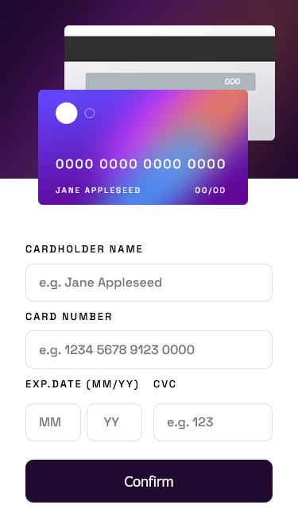

# Frontend Mentor - Interactive Card Details Form

This is a solution to the [Interactive Card Details Form on Frontend Mentor](https://www.frontendmentor.io/challenges/interactive-card-details-form-XpS8cKZDWw).

## Table of contents

- [Overview](#overview)
- [The challenge](#the-challenge)
- [Screenshots](#screenshots)
- [Links](#links)
- [Built with](#built-with)
- [Author](#author)

## Overview

### The challenge

Users should be able to:

- Fill in the form and see the card details update in real-time
- Receive error messages when the form is submitted if:
- Any input field is empty
- The card number, expiry date, or CVC fields are in the wrong format
- View the optimal layout depending on their device's screen size
- See hover, active, and focus states for interactive elements on the page

### Screenshots

#### Desktop View

#### Mobile View

### Links

- Solution URL: [Frontend Mentor](https://www.frontendmentor.io/profile/thaykrgl)
- Live Site URL: [Github Pages](https://thaykrgl.github.io/interactive-rating-component/)

### Built with

- Semantic HTML5 markup
- Mobile-first workflow
- Font Awesome
- SASS
- Flexbox
- Media Queries
- Google Fonts

## Author

- Linkedin - [Taha](https://www.linkedin.com/in/tahaaykiroglu)
- Frontend Mentor - [@thaykrgl](https://www.frontendmentor.io/profile/thaykrgl)
